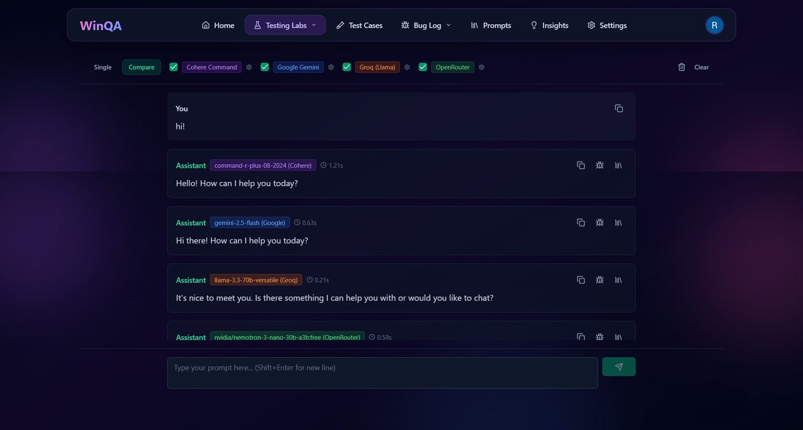
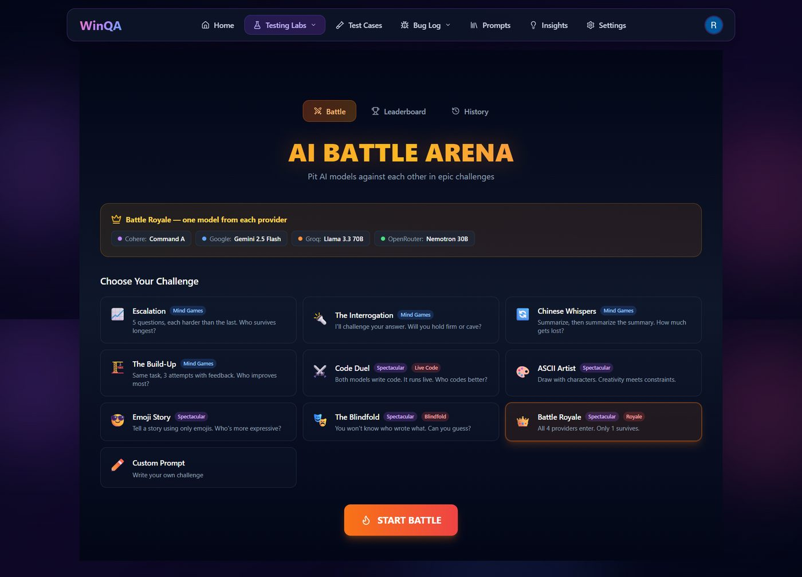
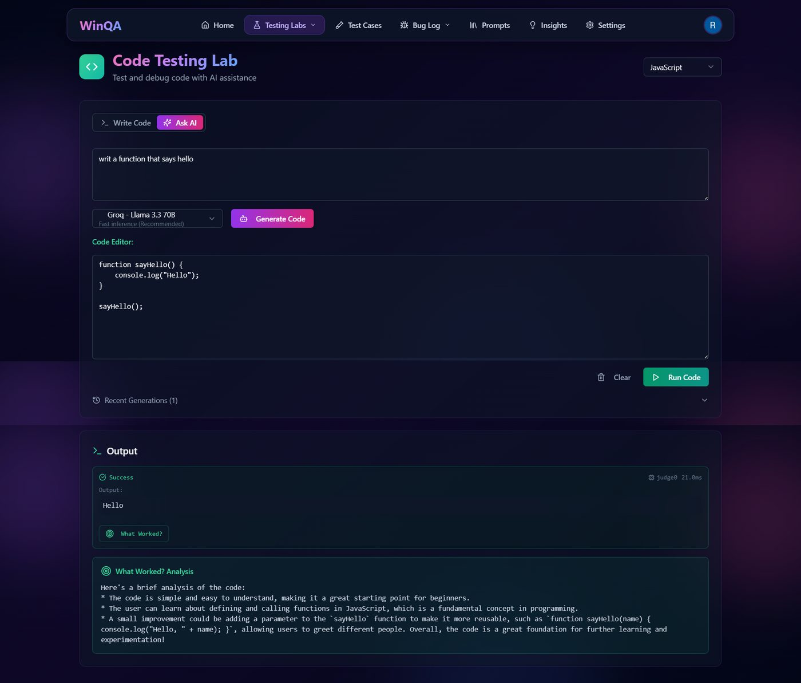
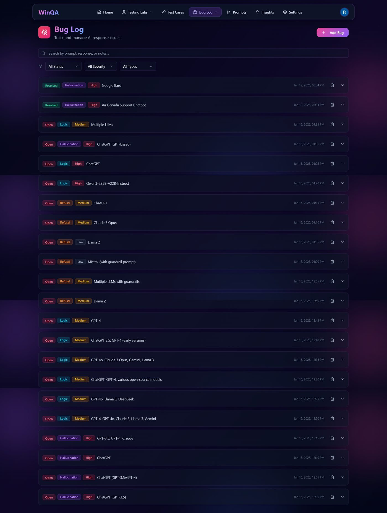

<div align="center">

# ⚔️ WinQA - AI Testing Playground

**Compare AI models. Document failures. Master prompt engineering.**

[](https://winqa.ai)
[](https://nextjs.org/)
[](https://typescriptlang.org/)
[](https://mongodb.com/)

*An open-source platform for QA professionals to test, compare, and break AI systems.*

</div>

---

## Why WinQA?

AI models hallucinate, refuse valid requests, fail at logic, and break in unexpected ways. WinQA gives you the tools to find, document, and learn from these failures — all in one place.

No more switching between ChatGPT, Gemini, and Claude tabs. Test them all simultaneously, pit them against each other, and build a knowledge base of what works and what doesn't.

---

## Features

### 🧪 Chat Lab · Compare Mode
Send one prompt to 4 AI models simultaneously. See who responds fastest, who hallucinates, and who gives the best answer — side by side.



**Supported providers:** Cohere Command A · Google Gemini 2.5 Flash · Groq Llama 3.3 70B · OpenRouter (NVIDIA Nemotron)

---

### ⚔️ AI Battle Arena
9 unique challenge types where AI models compete head-to-head:

- **Mind Games** — Escalation, Interrogation, Chinese Whispers, Build-Up
- **Spectacular** — Code Duel (live execution), ASCII Art, Emoji Story, Blindfold, Battle Royale

Vote A/B/Tie, track results on the leaderboard, review battle history.



---

### 💻 Code Testing Lab
Write or generate code with AI, then run it live in JavaScript, Python, or TypeScript. Get instant output and AI-powered "What Worked?" analysis.



---

### 🐛 Bug Log
Document real AI failures with severity levels, issue types (Hallucination, Logic, Refusal, Formatting), and the exact prompts that caused them. 22+ documented cases including real incidents like Air Canada's chatbot legal case and Google Bard's JWST error.



---

### 📚 More Tools

- **Test Cases** — 20 ready-made test scenarios for AI systems
- **Prompt Library** — 17 before/after prompt examples (bad vs. good)
- **Insights** — 12 documented learnings from testing AI models

---

## Tech Stack

| Layer | Technology |
|-------|-----------|
| **Framework** | Next.js 16 (App Router) |
| **Language** | TypeScript (Strict mode) |
| **Database** | MongoDB Atlas + Mongoose |
| **Auth** | Clerk (Google, GitHub, Email) |
| **Styling** | Tailwind CSS + shadcn/ui |
| **Animations** | Framer Motion |
| **Code Execution** | Piston API + Judge0 CE |
| **LLM Providers** | Cohere, Google Gemini, Groq, OpenRouter |
| **Deployment** | Vercel |

---

## Security

- **AES-256-GCM** encryption for stored API keys
- **Clerk authentication** with OAuth on all routes
- **User data isolation** — each user sees only their own data
- **NoSQL injection protection** with input sanitization
- **SSRF protection** — private URL blocking, HTTPS-only
- **CSP headers** for content security
- **0 npm vulnerabilities**

---

## Getting Started

### Prerequisites
- Node.js 18+
- MongoDB Atlas account (free tier works)
- Clerk account (free tier works)

### Installation
```bash
# Clone the repo
git clone https://github.com/Ranb972/WinQA.git
cd WinQA

# Install dependencies
npm install

# Set up environment variables
cp .env.example .env.local
# Fill in your MongoDB URI, Clerk keys, and (optionally) LLM API keys

# Run development server
npm run dev
```

Open [http://localhost:3000](http://localhost:3000) to see the app.

### Environment Variables
```env
MONGODB_URI=              # MongoDB Atlas connection string
NEXT_PUBLIC_CLERK_PUBLISHABLE_KEY=  # Clerk publishable key
CLERK_SECRET_KEY=         # Clerk secret key
ENCRYPTION_KEY=           # 32-byte hex string for API key encryption

# Optional — users can provide their own keys in Settings
COHERE_API_KEY=
GOOGLE_API_KEY=
GROQ_API_KEY=
OPENROUTER_API_KEY=
```

---

## Project Stats

| Metric | Value |
|--------|-------|
| Lines of code | ~17,000+ |
| Pages | 8 |
| API Routes | 16+ |
| LLM Providers | 4 |
| Battle Challenges | 9 (90+ prompts) |
| Documented AI Bugs | 22+ |
| Test Cases | 20 |
| Prompt Examples | 17 |

---

## License

This project is open source under the [MIT License](LICENSE).

---

## Author

Built by **Ran** — QA professional turned full-stack developer.

- 🌐 [winqa.ai](https://winqa.ai)
- 💻 [GitHub](https://github.com/Ranb972)

---

<div align="center">

**If you find WinQA useful, give it a ⭐ on GitHub!**

</div>
